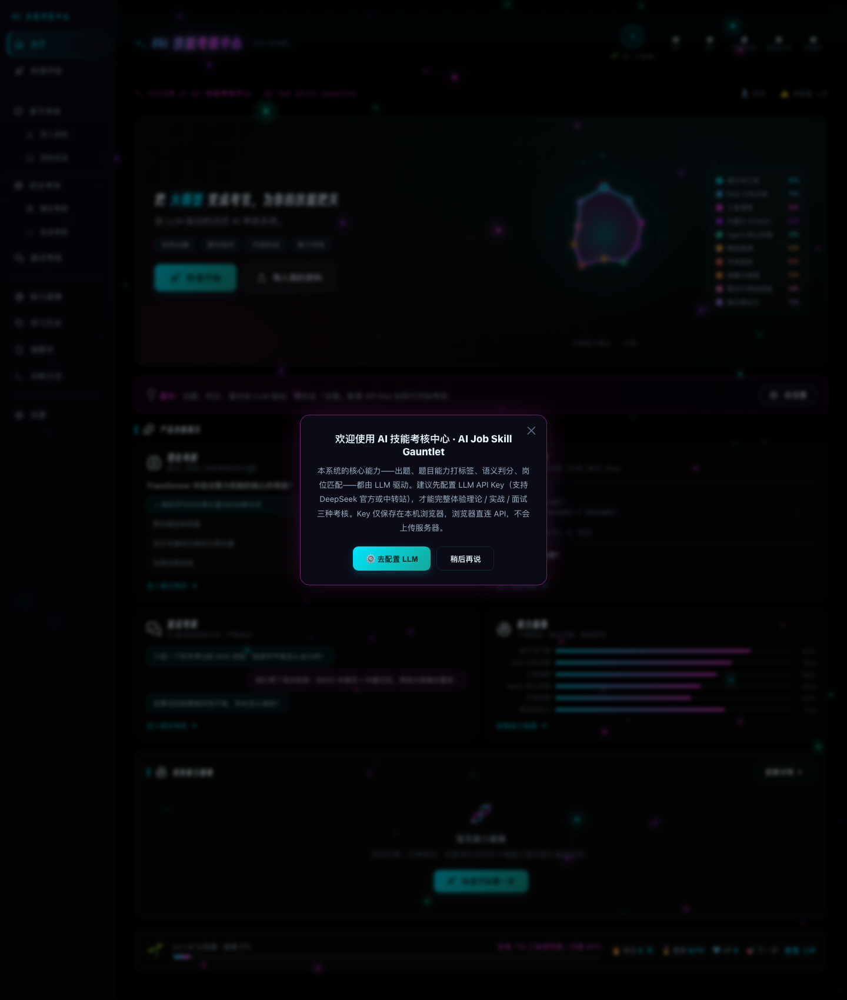

# ⚡ AI Job Skill Gauntlet · AI 技能考核中心

<div align="center">

**Local-first · LLM-powered · Simulated Interviewer · Skill Profiling · Gamified Growth**

▎ Run the gauntlet of a ruthless AI interviewer — 10 AI-job dimensions, probe by probe, until you crack or you prove you're the hire.

[](https://www.python.org/)
[](#)
[](#)
[](#)
[](#)
[](#license)

**English** · [中文文档](./README.zh-CN.md)

</div>

> **In one line**: Import your study materials, then run the gauntlet of a simulated interviewer that probes, roasts, and even kicks you out — walk away with a 10-dimension skill radar + job-match report + gamified growth.

<div align="center">



</div>

---

## ✨ Why this exists

You've studied tons of AI / Agent / RAG knowledge — but do you actually **know it**?

- ❌ Rote-memorized questions you forget the next day
- ❌ Answers that work until the phrasing changes
- ❌ Zero interview pressure until it's a real interview

This system fixes exactly that: **turn your study materials into questions that separate "real understanding" from "memorization", then let a ruthless interviewer expose what you don't actually know.**

---

## 🚀 Core Capabilities

| Capability | Description |
|---|---|
| 📥 **Materials → Questions** | Drop in a whole folder; LLM parses notes/code/data and generates **12 exam questions** (8 theory + 4 practical) + 3 job-interview reference questions |
| 📘 **Theory Exam** | Multiple-choice / true-false / fill-in-the-blank, judged by code with zero error |
| 🛠️ **Practical Exam** | Questions built on **your course's actual code** — not a generic "implement a function", but "fix the filter logic in this demo" |
| 💼 **Interview** | Pick from 8 AI roles via a dedicated intro page; a simulated interviewer that **probes, downgrades, roasts, and ends the interview early** |
| 🔍 **Diagnostics Log** | JSONL event logs for every feature (import / exam / interview / LLM calls / system errors); filter, export and clear from the in-app Diagnostics page |
| 🧬 **10-Dimension Profile** | Neon radar with color-coded vertices + legend, baseline level + job-match suggestions |
| 🎮 **Gamified Growth** | XP / levels / badges / streaks |
| 🔒 **Local-first** | Notes, question banks & history live in `~/.exam-center/`; your API key never leaves the browser. AI question generation / grading / interview send **material excerpts** (concepts, chapter summaries, code snippets) directly to the model provider you configure — nothing is stored server-side |

---

## 💼 The Interviewer — more than "asking questions"

The most human part of the whole system — this is the gauntlet. It will:

- 🎬 **Have mannerisms**: `(closes your resume, sighs)`、`(furrows brows, leans forward)`
- 🔍 **Probe ≥3 times per question**: even a decent answer gets dug deeper — why, drawbacks, edge cases, counterexamples
- 😤 **Downgrade when you can't answer**: "I don't know / can't" → point it out sharply, then break the question into the most basic sub-question
- 😏 **Roast you after repeated misses**: "That's the Nth time you couldn't answer — is your resume a little inflated?"
- 🚪 **End it early**: 4 cumulative misses on basics, and the interviewer closes your resume — "go back and build the fundamentals first"

Each of the 8 roles has its own **dedicated persona + knowledge graph + real interview-question arsenal**:

```
Agent Engineer · LLM App Dev · AI Platform/Inference · ML/Algorithm
RAG/Retrieval · Multimodal/Vision · AI Eval/Quality · Prompt Engineer
```

---

## 🧬 Skill Profile

After each exam, the system accumulates a **10-dimension skill radar**:

```
Prompt Engineering · RAG & Knowledge · Tool Calling · Vector & Embedding · Agent Core
Model Fine-tuning · Dev Frameworks · Deployment & Inference · Algorithms & Neural Nets · Interview Communication
```

From it you get: a **baseline level** + **your best-matched AI roles** (top suggestions).

---

## 🚀 Quick Start

> **You'll need**: Python 3.10+ · an LLM API key (DeepSeek / Alibaba Bailian / any OpenAI-compatible endpoint)

### Option 1: Run from source (recommended)

```bash
# 1. Install Python 3.10+
git clone https://github.com/Badegg404/ai-job-skill-gauntlet.git
cd ai-job-skill-gauntlet

# 2. Start (auto-opens browser)
./start.sh          # macOS / Linux
# On Windows, run `python3 server.py` (start.sh is a bash script for macOS/Linux)

# 3. Open http://127.0.0.1:8765 in your browser
```

### Option 2: Package as a desktop app

```bash
python3 -m venv .venv-build && source .venv-build/bin/activate
pip install pyinstaller
pyinstaller --clean --noconfirm build.spec
open dist/AI面试能力评估.app    # macOS
```

### First-time onboarding (new-user guide)

The app guides first-time users through the flow step by step — no more wondering what to do first:

- **🏠 Home-page guide bar** (always visible until all steps are done): a 6-step checklist — ① Configure LLM → ② Import study materials → ③ Chapter exam (per-section, recommended first) → ④ Comprehensive exam (all chapters mixed) → ⑤ Interview (AI interviewer, last challenge) → ⑥ View your skill profile. Each step shows its real-time status (✅ done / 🔒 waiting), and the **next action you should take is highlighted with a "Go →" button**.
- **🚀 Quick-start page**: a 6-step action checklist (configure LLM → import → chapter → comprehensive → interview → profile), each step with a "Go →" jump button (the old spotlight tour was removed in v2.1).

### Configure the LLM (required)

On first launch, fill in an API key under "⚙️ Settings" (supports **DeepSeek official**, **Alibaba Bailian**, and any OpenAI-compatible endpoint). The key is used by your browser to call the LLM directly, and can also be auto-filled from local environment variables — **it never leaves your machine**.

---

## 🏗️ Architecture

```
┌─────────────────────────────────────────────────┐
│           Frontend (zero framework, zero bundler) │
│  exam.js(logic) · prompts.js(prompts) · profile.js│
│  scoring.js(judging) · job_knowledge.json(8 roles)│
└──────────────────┬──────────────────────────────┘
                   │ HTTP (127.0.0.1:8765)
┌──────────────────▼──────────────────────────────┐
│      Python backend (pure stdlib, no deps)        │
│  server.py(HTTP) · pipeline.py(parse & generate)  │
│  storage.py(storage) · parser/(note parsing)      │
└──────────────────┬──────────────────────────────┘
                   │ browser-direct (key never leaves)
┌──────────────────▼──────────────────────────────┐
│   LLM (DeepSeek / Qwen / any OpenAI-compatible)    │
│   question gen · judging · interviewer · tagging   │
└─────────────────────────────────────────────────┘
```

**Core philosophy**: `LLM handles semantics, code handles data + prompts + fallback validation` — anything that "must always hold" (probe count, randomness, whitelist, dedup) is enforced by code, never left to the LLM's "initiative".

---

## 📁 Layout

```
.
├── server.py            # HTTP server (ThreadingHTTPServer, pure stdlib)
├── pipeline.py          # material parsing → course JSON → question pipeline
├── storage.py           # persistence (~/.exam-center/)
├── utils.py             # note detection / dedup / helpers
├── parser/              # Markdown note parser
├── web/                 # frontend (zero-framework vanilla JS)
│   ├── exam.js          # core interaction logic
│   ├── icons.js         # Lucide SVG icon library (53 icons)
│   ├── dataio.js        # LLM input sanitization (INPUT_LIMITS)
│   ├── schema.js        # LLM output schema validation
│   ├── logger.js        # frontend log reporting
│   ├── prompts.js       # all LLM prompts (centralized)
│   ├── scoring.js       # judging / question validation
│   ├── profile.js       # skill profile / levels / badges
│   ├── job_knowledge.js # job-knowledge loader (fetches the JSON)
│   ├── job_knowledge.json  # 8-role knowledge base (real interview questions)
│   └── fonts/           # web fonts (Orbitron / Share Tech Mono / Smiley)
├── tests/               # 122 tests (26 backend + 96 frontend)
├── docs/                # maintenance docs (architecture diagram / data plan / UI plan / review)
└── build.spec           # PyInstaller config
```

---

## 🧪 Tests

```bash
./run_tests.sh    # run all 122 tests
```

---

## 🔒 Privacy

- **Local storage**: notes, question banks, and exam history live in `~/.exam-center/`; the app itself runs fully offline
- **AI features send material to your model provider**: when AI question generation / grading / interview are enabled, the browser sends material excerpts (concepts, chapters, code previews) directly to the LLM provider you configure (DeepSeek / Bailian etc.). Your API key never leaves the browser, and nothing is stored server-side
- **API key never leaves your machine**: the browser calls the LLM directly; the backend may read the key from local environment variables to auto-fill it, but never uploads or stores it anywhere
- **Single-user by design**: built for personal learning, not multi-tenant

---

## 📄 License

[MIT](./LICENSE)

---

<div align="center">

**⭐ If this project helps you, give it a Star!**

*Polished line by line — from a vague idea to a working interview system.*

</div>
