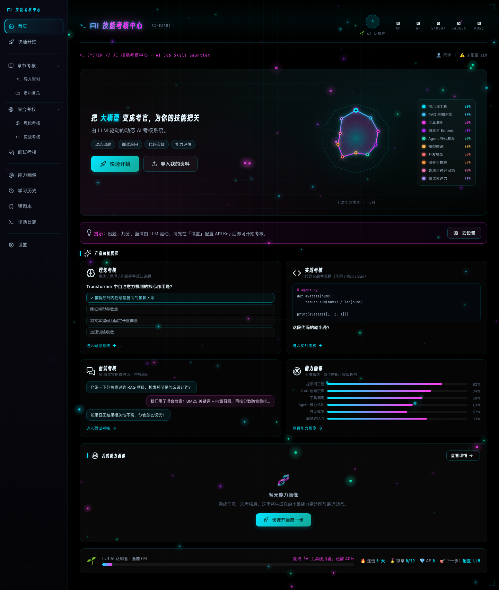

# ⚡ AI 技能考核中心 · AI Job Skill Gauntlet

<div align="center">

**本地运行 · LLM 驱动 · 仿真面试官 · 能力画像 · 游戏化成长**

▎ 闯过 AI 面试官的能力试炼 —— 10 个 AI 岗位维度，一层层追问，要么被问穿，要么证明你够格。

[](https://www.python.org/)
[](#)
[](#)
[](#)
[](#)
[](#license)

[English](./README.md) · **中文**

</div>

> **一句话**：导入你的学习资料，闯过 AI 面试官的能力试炼——10 个 AI 岗位维度，一层层追问，要么被问穿，要么证明你够格，最后得到一张 10 维能力雷达图 + 岗位匹配报告 + 游戏化成长等级。

<div align="center">



</div>

```bash
# 1. 安装 Python 3.10+
git clone https://github.com/Badegg404/ai-job-skill-gauntlet.git
cd ai-job-skill-gauntlet

# 2. 启动（自动打开浏览器）
./start.sh          # macOS / Linux
# Windows 运行 python3 server.py（start.sh 是 macOS/Linux 的 bash 脚本）

# 3. 浏览器打开 http://127.0.0.1:8765
```

### 方式二：打包成桌面应用

```bash
python3 -m venv .venv-build && source .venv-build/bin/activate
pip install pyinstaller
pyinstaller --clean --noconfirm build.spec
open dist/AI面试能力评估.app    # macOS
```

### 新人引导（首次使用）

系统内置了完整的首次使用引导，进去不再迷茫第一步做什么：

- **🏠 首页「快速开始」引导条**（完成前常驻）：6 步清单 —— ① 配置 LLM → ② 导入学习资料 → ③ 章节考核（按章节分阶段，建议优先）→ ④ 综合考核（跨章节混合）→ ⑤ 面试考核（AI 面试官，最后挑战）→ ⑥ 查看能力画像。每步实时显示状态（✅ 已完成 / 🔒 待完成），并且**当前最该做的一步会自动高亮并带「去完成 →」按钮**。
- **🚀 快速开始页**：6 步行动清单（配置 LLM → 导入 → 章节 → 综合 → 面试 → 画像），每步带「去完成 →」跳转按钮（v2.1 已移除旧的高亮引导 Tour）。

### 配置 LLM（必需）

首次使用在「⚙️ 设置」里填 API Key（支持 **DeepSeek 官方**、**阿里云百炼** 等 OpenAI 兼容接口）。Key 由浏览器直连 LLM 使用，也可从本机环境变量一键读取自动填入——**全程不出本机**。

---

## 🏗️ 技术架构

```
┌─────────────────────────────────────────────────┐
│              前端（零框架零打包器）                    │
│  exam.js(交互) · prompts.js(提示词) · profile.js     │
│  scoring.js(判分) · job_knowledge.json(8岗位题库)    │
└──────────────────┬──────────────────────────────┘
                   │ HTTP (127.0.0.1:8765)
┌──────────────────▼──────────────────────────────┐
│           Python 后端（纯标准库，无外部依赖）          │
│  server.py(HTTP) · pipeline.py(解析出题)            │
│  storage.py(存储) · parser/(笔记解析)               │
└──────────────────┬──────────────────────────────┘
                   │ 浏览器直连（Key 不出浏览器）
┌──────────────────▼──────────────────────────────┐
│         LLM（DeepSeek / 通义千问 / 任何 OpenAI 兼容）  │
│        出题 · 判分 · 面试官 · 能力打标签                │
└─────────────────────────────────────────────────┘
```

**核心设计哲学**：`LLM 做语义，程序做数据 + 提示词 + 兜底校验`——凡是「必须保证」的规则（追问次数、出题随机、白名单、去重）都由程序硬约束，不赌 LLM 的「自觉」。

---

## 📁 目录结构

```
.
├── server.py            # HTTP 服务（ThreadingHTTPServer，纯标准库）
├── pipeline.py          # 资料解析 → 课程 JSON → 出题管线
├── storage.py           # 数据持久化（~/.exam-center/）
├── utils.py             # 笔记识别 / 去重 / 工具函数
├── parser/              # Markdown 笔记解析器
├── web/                 # 前端（零框架原生 JS）
│   ├── exam.js          # 核心交互逻辑
│   ├── prompts.js       # 全部 LLM 提示词（集中管理）
│   ├── scoring.js       # 判分 / 题目校验
│   ├── profile.js       # 能力画像 / 等级 / 徽章
│   ├── job_knowledge.js # 岗位知识库加载器（fetch JSON）
│   ├── job_knowledge.json  # 8 岗位知识库（大厂真题）
│   └── fonts/           # 网页字体（Orbitron / Share Tech Mono / Smiley）
├── tests/               # 38 个测试（后端 16 + 前端 22）
├── docs/                # 维护文档
└── build.spec           # PyInstaller 打包配置
```

---

## 🧪 测试

```bash
./run_tests.sh    # 一键跑全部 38 个测试
```

---

## 🔒 隐私

- **本地存储**：笔记、题库、考核记录都存在 `~/.exam-center/`，程序本身可完全离线运行
- **AI 功能会把资料发送给模型服务商**：开启 AI 出题/判分/面试后，浏览器会把资料摘要（概念/章节/代码预览）直连发送给你配置的 LLM 服务商（如 DeepSeek / 百炼）。API Key 不出浏览器，服务端不存储任何资料
- **API Key 全程不出本机**：浏览器直连 LLM；后端可能从本机环境变量读取 Key 用于自动填入，但绝不上传、不存储到任何地方
- **单机单用户**：为个人学习设计，非多租户服务

---

## 📄 License

[MIT](./LICENSE)

---

<div align="center">

**⭐ 如果这个项目对你有帮助，点个 Star 吧！**

*从「模糊需求」到「能打的面试系统」，一行行打磨出来的。*

</div>
