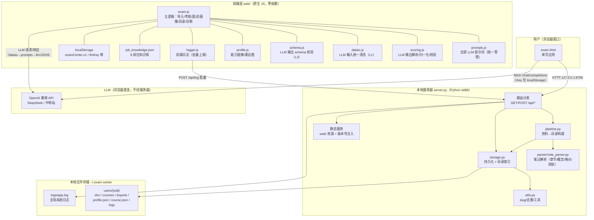
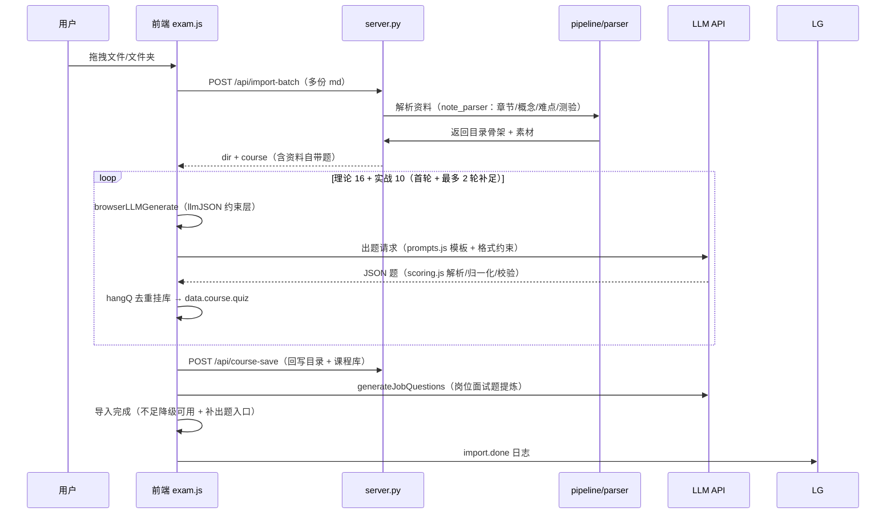
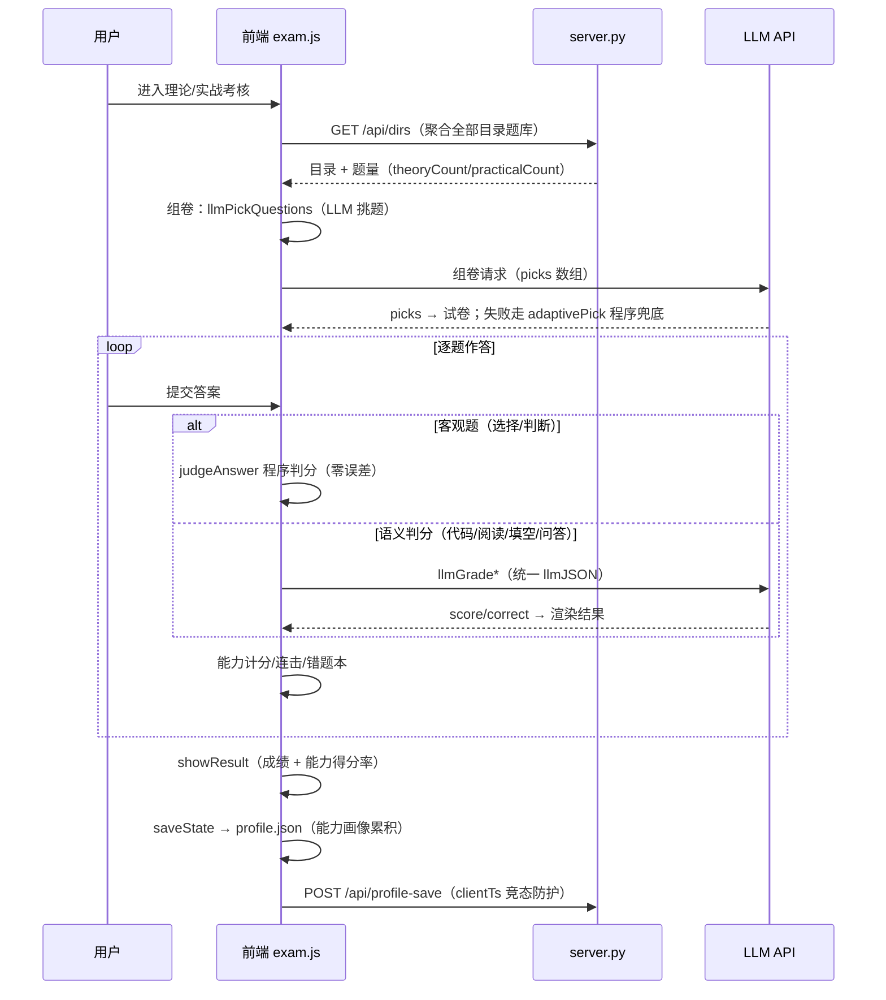
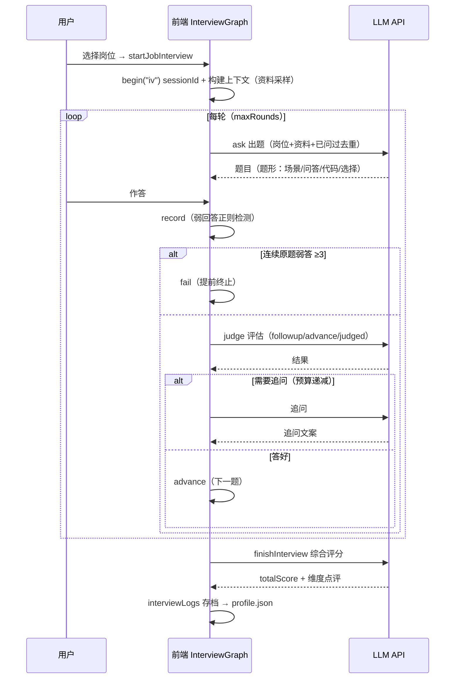
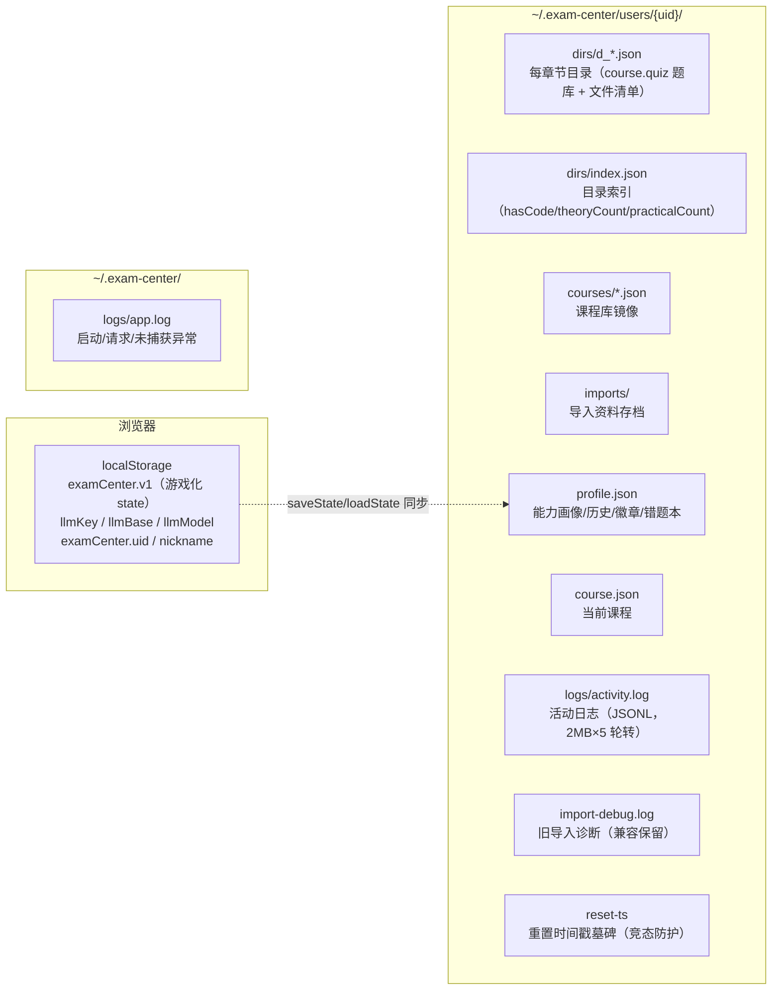
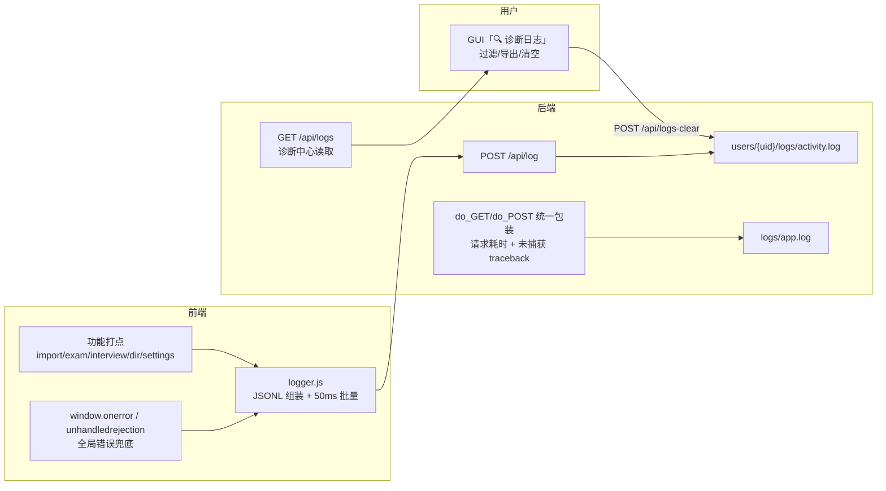

# 产品架构图：AI 岗位能力试炼

> 覆盖：系统总体架构 · 三大功能数据流（导入出题 / 考核 / 面试）· 数据存储结构 · 日志系统数据流。
> 图用 Mermaid 绘制（GitHub 自动渲染；dsh 预览面板可渲染 .md）。

---

## 一、系统总体架构

**要点**：
- **LLM 链路与数据链路分离**：出题/判分/面试的 LLM 请求由浏览器直连 API（Key 不出浏览器）；服务器只存数据、不接触 Key。
- **三层数据约束**（数据统一方案）：LLM 输入走 `dataio.js` 清洗（L1）→ 统一调用器 `llmJSON`（L2）→ 输出走 `schema.js` 校验（L3）。

---

## 二、三大功能数据流

### 2.1 导入出题（资料 → 章节目录 → 题库）

### 2.2 考核（组卷 → 答题 → 判分 → 画像）

### 2.3 面试（StateGraph 八节点）

---

## 三、数据存储结构

---

## 四、日志系统数据流

---

## 五、关键模块与文件对照

| 功能 | 前端 | 后端 | 数据 |
|---|---|---|---|
| 导入出题 | exam.js（handleImportFileList/browserLLMGenerate/hangQ） | server.py /api/import-batch + pipeline.py + note_parser.py | dirs/d_*.json + courses/*.json + imports/ |
| 考核 | exam.js（startExam/llmPickQuestions/llmGrade*/judgeAnswer） | server.py /api/dirs /api/dir | dirs 题库 + profile.json |
| 面试 | exam.js（InterviewGraph 八节点） | —（纯前端 + LLM） | profile.json（interviewLogs） |
| 能力画像 | profile.js（drawRadarProfile/abilityProfilePct） | server.py /api/profile /api/profile-save | profile.json + localStorage v1 |
| 目录管理 | exam.js（showLibrary/renameDir/deleteDir/fileAdd） | server.py /api/dir-* + storage.py | dirs/ + courses/ |
| LLM 提示词 | prompts.js（SYSTEM/教学法/各构建函数） | — | — |
| LLM 输入清洗 | dataio.js（INPUT_LIMITS/sanitizeMaterial） | — | — |
| LLM 输出校验 | schema.js（QUESTION_SCHEMA/OBJECT_SCHEMAS） | — | — |
| 日志 | logger.js + exam.js 打点 + 诊断中心 | server.py /api/log /api/logs /api/logs-clear | logs/activity.log + logs/app.log |
| 设置/重置 | exam.js（saveLLMSettings/testLLMConnection/resetAllData） | server.py /api/llm-env /api/reset-all | localStorage + 用户目录 + reset-ts |

---

## 六、图的使用与维护

- **查看**：GitHub 仓库自动渲染本文件的 Mermaid 图；dsh 预览面板打开 .md 也可渲染
- **维护**：改代码后同步更新对应图（数据流变化优先更新时序图；新增存储改第三节；新增功能改第五节对照表）
- **本文档为文档**，不参与运行；与 docs/数据统一方案.md（数据约束）、HANDOFF.md（开发交接）配合使用
